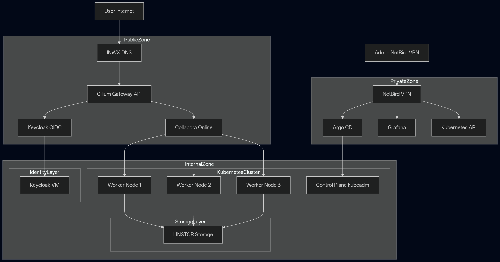

# Architecture Overview

## Principles

- Identity-first: All access is authenticated via OIDC (Keycloak)
- GitOps-driven: All platform changes are applied declaratively via ArgoCD
- Sovereign: Platform is self-hosted and independent of hyperscalers
- Secure-by-default: Network policies and zero-trust principles apply
- Low operational overhead: Designed to minimize manual intervention

## High-Level Architecture

The platform is composed of:

- A Kubernetes cluster provisioned via OpenTofu on Hyper-V
- GitOps-driven deployment using ArgoCD
- Cilium for networking and ingress control
- Longhorn for distributed storage
- Keycloak as the identity provider (OIDC), running outside the Kubernetes cluster on a dedicated VM
- Velero for backup and restore
- NetBird VPN for secure operator access
- DNS managed externally (one.com)

Applications (e.g., Nextcloud, Collabora) run inside the cluster and rely on platform services.

## Trust Boundaries

- External:
  - Internet
  - DNS provider
  - User devices

- Secure Access Boundary:
  - NetBird VPN is required for administrative access

- Cluster Boundary:
  - All workloads run inside Kubernetes
  - Network policies are enforced via Cilium

- Identity Boundary:
  - Keycloak runs outside the Kubernetes cluster
  - Acts as the central identity provider
  - No service trusts unauthenticated traffic

## Access Model

- End-users access applications via:
  Internet → DNS → Cilium Gateway → Applications

- Operators access the platform via:
  User → NetBird VPN → Cluster (kubectl, SSH, Grafana)

## Core Domains

### Identity
- Keycloak (OIDC provider, deployed on external VM)
- Central authentication and SSO

### Compute
- Kubernetes cluster (control plane + workers)
- Provisioned via OpenTofu on Hyper-V

### Networking
- Cilium (CNI + Network Policies)
- Cilium Gateway (Ingress)

### Storage
- Longhorn (distributed block storage)

### GitOps
- ArgoCD (declarative deployments)

### Backup & Recovery
- Velero (cluster + volume backups)

### Access
- NetBird VPN (secure operator access)

### Applications
- Nextcloud
- Collabora
- Future workloads
